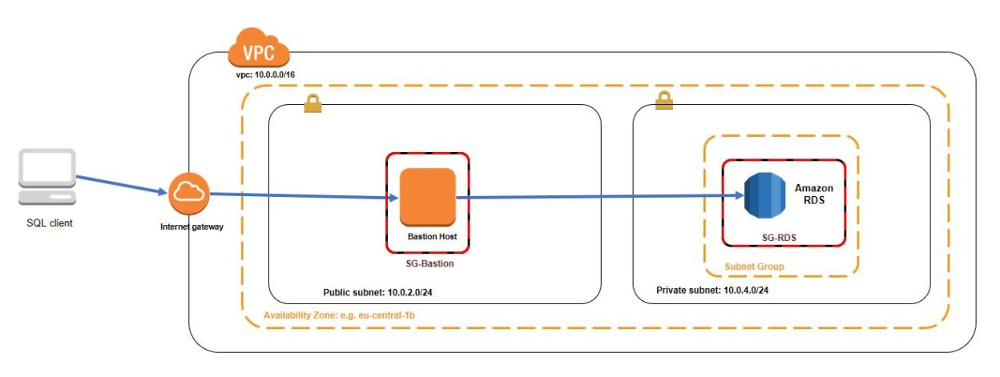

SSH tunnel through a AWS VPC Bastion Host
=========
When we create VPC usually 2 types of subnets are created ie public and private subnets. In Public subnets as name suggests it will have applications exposed to internet like ALB’s,Bastion,NLB’s etc..

The Problem is how to connect to private subnet instances which are not directly accessible from internet(Does not have public-IP). It can be solved by Creating a transparent SSH tunnel through a bastion host using the ProxyCommand configuration parameter

Source: https://myopswork.com/transparent-ssh-tunnel-through-a-bastion-host-d1d864ddb9ae



Connect to private subnet via AWS Bastion Host
-------
Add this to you `~/.ssh/config`
```bash
~/.ssh/config
Host jumphost
   HostName 10.0.1.43 
   User ec2-user
   IdentityFile ~/.ssh/devops.pem
   ProxyCommand none
   
Host securehost
   HostName 10.0.200.96
   User ec2-user 
   IdentityFile ~/.ssh/devops.pem
   ProxyCommand ssh jumphost -W %h:%p   
```
The script above will create a silent port forwarding to `AWS Bastion Host` then hop to the `securehost`

```bash
> ssh securehost
Last login: Tue Nov 27 06:56:39 2018 from ip-10-0-1-43.us-east-2.compute.internal

       __|  __|_  )
       _|  (     /   Amazon Linux AMI
      ___|\___|___|

https://aws.amazon.com/amazon-linux-ami/2018.03-release-notes/
[ec2-user@ip-10-0-200-96 ~]$
```

Connect to `AWS RDS` on  the private subnet from local machine
-------
```bash
ssh -f securehost -L 5000:database.us-east-2.rds.amazonaws.com:5432 -N 2>/dev/null
```
where,
  * `-f` puts ssh in background 
  * `-N` makes it not execute a remote command
  * `-L` Specifies that the given port on the local (client) host is to be forwarded to the given host and port on the remote side

This will forward all local port `5000` traffic to port `5432` on the remote `database.us-east-2.rds.amazonaws.com` instance. 

```bash
psql --host=127.0.0.1 --port=5000 --username=root --password --dbname=postgres
```


